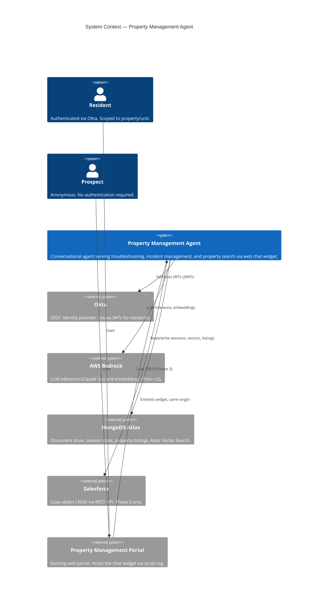
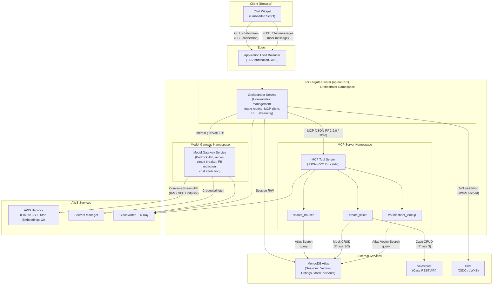
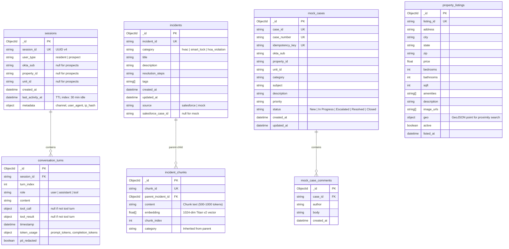
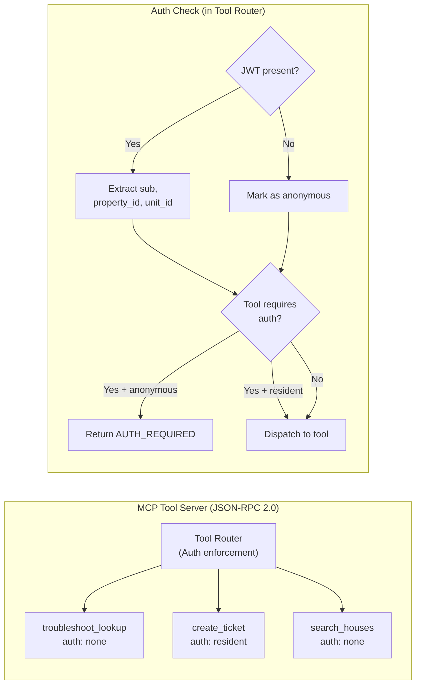
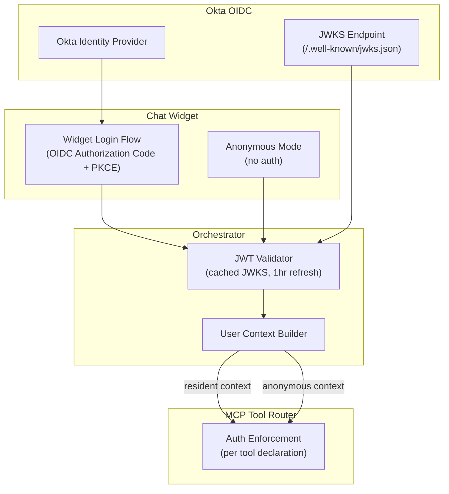
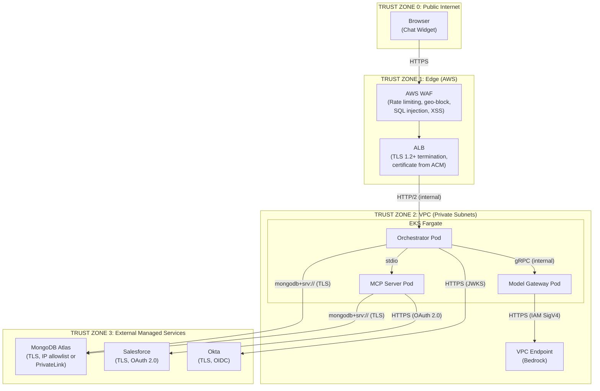
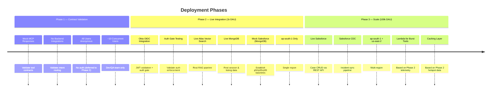

# Property Management Agent — High-Level Design

| Field | Value |
|-------|-------|
| **Status** | Draft |
| **Version** | 0.1.0 |
| **Date** | 2026-08-03 |
| **Author** | Architecture Team |
| **Audience** | Engineering, Product, Security |

---

## Table of Contents

1. [Executive Summary](#1-executive-summary)
2. [System Context](#2-system-context)
3. [Component Architecture](#3-component-architecture)
4. [Request Flows](#4-request-flows) *(→ openspec capability specs)*
5. [Data Architecture](#5-data-architecture)
6. [MCP Tool Architecture](#6-mcp-tool-architecture) *(→ openspec tool contracts)*
7. [Model Gateway](#7-model-gateway) *(→ conversation-orchestration spec)*
8. [Session & State Management](#8-session--state-management) *(→ conversation-orchestration spec)*
9. [Authentication & Authorization](#9-authentication--authorization)
10. [Trust Boundaries & Security](#10-trust-boundaries--security)
11. [PII Handling & Compliance](#11-pii-handling--compliance)
12. [Non-Functional Requirements](#12-non-functional-requirements)
13. [Phase Strategy](#13-phase-strategy)
14. [Architectural Decisions Record](#14-architectural-decisions-record)
15. [Terraform Module Plan](#15-terraform-module-plan)
16. [Risks & Mitigations](#16-risks--mitigations)
17. [Out of Scope](#17-out-of-scope)

---

## 1. Executive Summary

This document defines the high-level architecture for a **single-tenant, web-based conversational agent** serving a property management operator. The agent provides three domain capabilities to two user classes:

| Capability | Residents (Authenticated) | Prospects (Anonymous) |
|------------|:------------------------:|:---------------------:|
| Knowledge Troubleshooting (HVAC, smart locks, HOA) | ✅ | ✅ |
| Incident Management (create/read Salesforce tickets) | ✅ | ❌ |
| Property Search (natural-language listing search) | ✅ | ✅ |

The system is deployed on AWS (`ap-south-1`), uses **Anthropic Claude 3.x on AWS Bedrock** for LLM inference, **Amazon Titan Embeddings v2** for vector embeddings, **MongoDB Atlas** for data and vector storage, and **Salesforce** (Enterprise) for case management. All domain capabilities are exposed to the orchestrator exclusively through the **Model Context Protocol (MCP)** standard.

The architecture is a **single design delivered in three phases** — from mock-based contract validation (Phase 1) through live integrations at 1k DAU (Phase 2) to scaled multi-region production at 100k DAU (Phase 3).

---

## 2. System Context

The following diagram shows the system boundary and all external actors/dependencies.



### External Dependencies

| Dependency | Protocol | Auth Mechanism | Managed By Us? |
|------------|----------|---------------|:--------------:|
| MongoDB Atlas | `mongodb+srv://` (TLS) | Connection string (Secrets Manager) | ❌ (external) |
| AWS Bedrock | AWS SDK (HTTPS) | IAM Role (IRSA) | ❌ (AWS managed) |
| Okta | OIDC / JWKS (HTTPS) | JWKS endpoint (cached) | ❌ (external) |
| Salesforce | REST API (HTTPS) | OAuth 2.0 Client Credentials | ❌ (external) |

---

## 3. Component Architecture

### 3.1 Component View



### 3.2 Component Responsibilities

| Component | Runtime | Responsibilities | Scaling |
|-----------|---------|-----------------|---------|
| **Chat Widget** | Browser (embedded `<script>`) | Renders chat UI, sends POST messages, consumes SSE stream, manages local conversation state for rendering | N/A (client-side) |
| **ALB** | AWS-managed | TLS termination, path-based routing, WAF rules, health checks | Auto-scaling |
| **Orchestrator Service** | EKS Fargate | Conversation lifecycle, JWT validation, intent routing via Claude tool_use, MCP client (spawns MCP server), SSE response assembly, session CRUD in MongoDB | HPA on CPU/memory + active connections |
| **Model Gateway Service** | EKS Fargate | All Bedrock API interaction, IAM credential management, request/response logging, PII redaction before egress, retry with backoff, circuit breaker, model tier selection, cost attribution per conversation | HPA on active inference requests |
| **MCP Tool Server** | EKS Fargate (co-located or sidecar) | Hosts all 3 tools behind standard MCP protocol, tool-level auth enforcement, request validation, tool dispatch | Scales with orchestrator |
| **MongoDB Atlas** | External managed | Session/conversation documents, property listing collections, Atlas Vector Search index, mock incident data (Phase 1–2) | Atlas auto-scaling (external) |

### 3.3 Inter-Component Communication

| From | To | Protocol | Pattern |
|------|-----|----------|---------|
| Widget → ALB | HTTPS | POST (messages), SSE (stream) |
| ALB → Orchestrator | HTTP/2 | Reverse proxy |
| Orchestrator → Model Gateway | gRPC (internal) | Request-response with streaming |
| Orchestrator → MCP Server | JSON-RPC 2.0 over stdio | Orchestrator spawns MCP server as child process; communicates over stdin/stdout per MCP spec |
| Model Gateway → Bedrock | HTTPS (AWS SDK) | `ConverseStream` API via VPC endpoint |
| MCP Tools → MongoDB | `mongodb+srv://` (TLS) | Connection-pooled queries |
| MCP Tools → Salesforce | HTTPS (REST) | OAuth 2.0 Client Credentials (Phase 3) |

---

## 4. Request Flows

Detailed request flows (sequence diagrams, scenarios, acceptance criteria) are defined in the capability specs. This section provides a summary with links.

| User Story | Capability Spec | MCP Tool Contract | Auth |
|------------|----------------|-------------------|------|
| Troubleshooting query (anonymous) | [knowledge-troubleshooting](../openspec/capabilities/knowledge-troubleshooting.md) | [`troubleshoot_lookup`](../openspec/contracts/troubleshoot-lookup.md) | None |
| Ticket creation (authenticated) | [incident-management](../openspec/capabilities/incident-management.md) | [`create_ticket`](../openspec/contracts/create-ticket.md) | Resident (Phase 2+) |
| Property search (anonymous) | [property-search](../openspec/capabilities/property-search.md) | [`search_houses`](../openspec/contracts/search-houses.md) | None |
| Human escalation | [incident-management](../openspec/capabilities/incident-management.md) | [`create_ticket`](../openspec/contracts/create-ticket.md) (category: escalation) | Resident (Phase 2+) |

### Request Flow Summary

All flows follow the same pattern:

1. **Client → Orchestrator**: User message via `POST /chat/messages` (with optional JWT)
2. **Orchestrator → Model Gateway**: `ConverseStream` with conversation history and tool declarations
3. **Model Gateway → Bedrock**: Claude determines intent and emits `tool_use` event
4. **Orchestrator → MCP Server**: JSON-RPC `tools/call` with tool arguments (+ auth context for `create_ticket`)
5. **MCP Server → Backend**: Tool executes against appropriate backend (fixtures Phase 1, live Phase 2+)
6. **Orchestrator → Model Gateway**: `ConverseStream` with tool result for final response
7. **Model Gateway → Client**: Streaming tokens via SSE

---

## 5. Data Architecture

### 5.1 MongoDB Atlas Collections

All data resides in a single MongoDB Atlas cluster, accessed via `mongodb+srv://` URI. Schema is designed from scratch.

#### Database: `prop_agent`



### 5.2 Index Strategy

| Collection | Index | Type | Purpose |
|-----------|-------|------|---------|
| `sessions` | `{ session_id: 1 }` | Unique | Session lookup |
| `sessions` | `{ last_activity_at: 1 }` | TTL (1800s) | Auto-expire idle sessions |
| `conversation_turns` | `{ session_id: 1, turn_index: 1 }` | Compound | Ordered turn retrieval |
| `incident_chunks` | `{ embedding: "vectorSearch" }` | Atlas Vector Search (HNSW, cosine) | RAG retrieval |
| `incident_chunks` | `{ parent_incident_id: 1 }` | Standard | Parent doc lookup for grounding |
| `incidents` | `{ category: 1 }` | Standard | Category filter |
| `property_listings` | Atlas Search index | Full-text + faceted | NL property search |
| `property_listings` | `{ geo: "2dsphere" }` | Geospatial | Proximity queries |
| `mock_cases` | `{ idempotency_key: 1 }` | Unique | Deduplication |
| `mock_cases` | `{ okta_sub: 1 }` | Standard | User's ticket history |

### 5.3 Atlas Vector Search Index Definition

```json
{
  "name": "incident_vector_index",
  "type": "vectorSearch",
  "definition": {
    "fields": [
      {
        "path": "embedding",
        "type": "vector",
        "numDimensions": 1024,
        "similarity": "cosine"
      },
      {
        "path": "category",
        "type": "filter"
      }
    ]
  }
}
```

**Query Pattern** (parent-child retrieval):
1. Vector search on `incident_chunks` → top-K chunks by cosine similarity
2. `$lookup` to `incidents` collection via `parent_incident_id` → retrieve full parent context (title, description, resolution_steps)
3. Return chunks enriched with parent context for LLM grounding

### 5.4 Connection Pool Sizing

| Service | Min Pool | Max Pool | Idle Timeout | Rationale |
|---------|----------|----------|-------------|-----------|
| Orchestrator | 5 | 20 | 30s | Session R/W on every request; moderate concurrency |
| MCP Tool Server | 10 | 50 | 60s | Handles all tool queries; `troubleshoot_lookup` is the hottest path |
| Ingestion Pipeline (CLI) | 1 | 5 | 10s | Batch process, short-lived |

---

## 6. MCP Tool Architecture

### 6.1 Protocol

All domain tools are exposed via the **Model Context Protocol (MCP)** standard:
- **Transport**: JSON-RPC 2.0 over stdio (orchestrator spawns MCP server as a child process)
- **Discovery**: The MCP server exposes a `tools/list` endpoint returning all available tools with their JSON Schema `inputSchema`
- **Invocation**: The orchestrator calls `tools/call` with the tool name and arguments
- **Schema Contract**: Phase 1 mocks and Phase 2+ live implementations satisfy the **same tool schemas** (Architectural Invariant #3)

### 6.2 Tool Registry



### 6.3 Tool Schemas Summary

| Tool | Auth | Idempotent | Category Filter | Phase 1 Backend | Phase 2+ Backend |
|------|------|-----------|----------------|-----------------|------------------|
| `troubleshoot_lookup` | `none` | Safe (read) | ✅ | Fixture JSON | Atlas Vector Search |
| `create_ticket` | `resident` | Yes (`idempotency_key`, 1hr window) | N/A | MongoDB `mock_cases` | MongoDB (P2) → Salesforce (P3) |
| `search_houses` | `none` | Safe (read) | N/A | Fixture JSON | Atlas Search |

### 6.4 Error Taxonomy (Shared)

All tools return errors in a consistent envelope:

```json
{
  "error": {
    "code": "VECTOR_STORE_UNAVAILABLE",
    "message": "Human-readable description",
    "retryable": true,
    "details": {}
  }
}
```

Per-tool error codes, retryability, and detailed error responses are defined in each tool contract:

- [`troubleshoot_lookup` errors](../openspec/contracts/troubleshoot-lookup.md#error-taxonomy)
- [`create_ticket` errors](../openspec/contracts/create-ticket.md#error-taxonomy)
- [`search_houses` errors](../openspec/contracts/search-houses.md#error-taxonomy)

---

## 7. Model Gateway

The Model Gateway is a dedicated service that **owns all LLM provider interaction** (Architectural Invariant #5). No other component communicates with Bedrock directly.

Responsibilities: PII redaction before egress, model tier selection, Bedrock ConverseStream invocation (IAM via IRSA), retry with exponential backoff, circuit breaker with Sonnet → Haiku failover, request/response logging, and per-session cost attribution.

> **Full specification** — responsibilities diagram, model tier strategy, PII redaction pipeline, and failure mode recovery table: [conversation-orchestration capability spec](../openspec/capabilities/conversation-orchestration.md#model-gateway).

---

## 8. Session & State Management

All session state is stored in MongoDB — **never in pod memory** (Architectural Invariant #4). Sessions expire after 30 minutes of inactivity via a MongoDB TTL index on `last_activity_at`. Conversation history uses a sliding window (default: 20 turns) with older turns summarised.

The client connects via `GET /chat/stream` (SSE) and sends messages via `POST /chat/messages`. The orchestrator streams tokens, tool execution events, and completion events back to the client. The AWS ALB idle timeout is kept at its default 60 seconds in Phase 2, which is safely maintained by a 15-second SSE heartbeat.

> **Full specification** — session lifecycle state diagram, externalised state design, SSE streaming model, and SSE event type reference: [conversation-orchestration capability spec](../openspec/capabilities/conversation-orchestration.md#session--state-management).

---

## 9. Authentication & Authorization

### 9.1 Identity Model



### 9.2 JWT Claims (Resident)

```json
{
  "iss": "https://{okta-domain}/oauth2/default",
  "sub": "okta-user-id-12345",
  "aud": "prop-agent-api",
  "iat": 1722700000,
  "exp": 1722703600,
  "property_id": "PROP-001",
  "unit_id": "UNIT-4B",
  "email": "resident@example.com",
  "name": "Jane Doe"
}
```

> `property_id` and `unit_id` are custom claims added to the Okta authorization server. If unavailable in the JWT, the orchestrator falls back to a MongoDB lookup using `okta_sub` to resolve the resident's property context.

### 9.3 Token Expiry & Refresh

The Chat Widget is responsible for managing Okta JWTs, including silent refresh via OIDC refresh tokens. If a token expires mid-session and cannot be refreshed, the Orchestrator degrades the user context to anonymous. Tools requiring auth (e.g., `create_ticket`) will subsequently return `AUTH_REQUIRED`, though the MongoDB session itself remains active for its 30-minute TTL.

### 9.4 Authorization Matrix

| Action | Anonymous | Resident | Enforcement Point |
|--------|:---------:|:--------:|-------------------|
| Send message | ✅ | ✅ | ALB (rate limit only) |
| `troubleshoot_lookup` | ✅ | ✅ | MCP Tool Router |
| `search_houses` | ✅ | ✅ | MCP Tool Router |
| `create_ticket` | ❌ | ✅ | MCP Tool Router |
| Read ticket status | ❌ | ✅ (own tickets only) | MCP Tool Router + `okta_sub` filter |
| Human escalation | ❌ | ✅ | MCP Tool Router (uses `create_ticket`) |

**Enforcement is always in the tool router, never in prompt instructions** (Architectural Invariant #2).

---

## 10. Trust Boundaries & Security



### 10.1 Security Controls Per Boundary

| Boundary Crossing | Controls |
|-------------------|----------|
| Internet → ALB | WAF (OWASP Core Rule Set), TLS 1.2+, rate limiting (100 req/min/IP), geo-restriction optional |
| ALB → EKS | Security groups (ALB SG → EKS SG on ports 8080/8443), no public IP on pods |
| EKS → Bedrock | VPC Endpoint (no internet traversal), IAM Role via IRSA (least-privilege) |
| EKS → MongoDB | TLS required, connection string in Secrets Manager, IP allowlist on Atlas (NAT Gateway EIPs) or PrivateLink |
| EKS → Salesforce | TLS, OAuth 2.0 Client Credentials, credentials in Secrets Manager, outbound via NAT Gateway |
| EKS → Okta | HTTPS to JWKS endpoint, no credentials needed (public keys), response cached |

### 10.2 Secrets Management

| Secret | Storage | Rotation | Access |
|--------|---------|----------|--------|
| MongoDB connection URI | Secrets Manager | Manual (Atlas-managed) | IRSA: orchestrator, MCP server |
| Salesforce OAuth client ID/secret | Secrets Manager | 90-day rotation | IRSA: MCP server only |
| Okta client ID | SSM Parameter Store (not secret) | Rarely changes | IRSA: orchestrator |
| Bedrock API access | IAM Role (no secret) | N/A (STS temporary credentials) | IRSA: model gateway only |

---

## 11. PII Handling & Compliance

### 11.1 CCPA Obligations

| Obligation | Implementation |
|------------|---------------|
| **Right to Know** | Conversation history retrievable by `okta_sub`. API endpoint for data export (Phase 3). |
| **Right to Delete** | Delete all documents matching `okta_sub` across `sessions`, `conversation_turns`, `mock_cases`. MongoDB `deleteMany` operation. |
| **Right to Opt-Out (Sale)** | No data sale. Conversations not shared with third parties beyond Bedrock inference. Bedrock does not retain input data. |
| **Data Minimisation** | PII redacted before LLM egress. Session TTL auto-deletes inactive data. Conversation logs retained max 90 days. |
| **Notification** | Chat widget displays privacy notice before first interaction. |

> [!NOTE]
> **DPDP Act 2023 (India)**: With `ap-south-1` as the primary region and Indian users likely, the Digital Personal Data Protection Act may also apply. Key additional requirements include explicit consent for data processing and data localisation provisions. **This is a compliance/legal decision, not an engineering one** — flagged for legal review.

### 11.2 PII Data Flow

```
User input → [Orchestrator: log with PII markers]
           → [Model Gateway: PII redaction]
           → [Bedrock: receives redacted text only]
           → [Response: no PII in LLM output by design]
           → [Conversation store: original input stored encrypted,
              redaction manifest stored separately]
```

| Data Store | PII Present? | Encryption | Retention |
|------------|:----------:|-----------|-----------|
| Conversation turns (MongoDB) | Yes (user input) | At-rest (Atlas encryption) + field-level encryption for PII fields | 90 days |
| Model Gateway logs (CloudWatch) | No (redacted) | CloudWatch encryption | 30 days |
| Redaction manifest (S3) | Yes (mapping) | SSE-KMS, bucket policy restricted | 90 days |
| Bedrock (transient) | No | AWS-managed, not persisted | None |

---

## 12. Non-Functional Requirements

### 12.1 Latency Targets

| Metric | Phase 1 | Phase 2 | Phase 3 |
|--------|---------|---------|---------|
| First-token latency (p50) | <2s | <1.5s | <1s |
| First-token latency (p99) | <4s | <3s | <2s |
| `troubleshoot_lookup` p99 | <200ms | <800ms | <500ms |
| `create_ticket` p99 | <300ms | <300ms | <2s |
| `search_houses` p99 | <200ms | <600ms | <400ms |
| End-to-end response (p95) | <6s | <5s | <3.5s |

### 12.2 Quality Targets

| Metric | Phase 1 | Phase 2 | Phase 3 |
|--------|---------|---------|---------|
| RAG groundedness | N/A | ≥85% | ≥90% |
| Refusal threshold | N/A | score < 0.3 | score < 0.3 |
| Intent classification accuracy | N/A | ≥90% | ≥95% |
| Ticket idempotency window | 1 hour | 1 hour | 1 hour |

### 12.3 Availability & Cost

| Metric | Phase 1 | Phase 2 | Phase 3 |
|--------|---------|---------|---------|
| Availability (monthly) | 95% | 99.5% | 99.9% |
| DAU | Dev team | ~1,000 | ~100,000 |
| Concurrent sessions | ~10 | ~200 | ~5,000 |
| Cost ceiling (monthly) | $500 | $3,000 | $15,000 |

### 12.4 Observability Stack

| Layer | Tool | Metrics |
|-------|------|---------|
| Infrastructure | CloudWatch Metrics | CPU, memory, network, EKS pod counts |
| Application | CloudWatch Logs + Structured JSON | Request/response logs, tool calls, errors |
| Tracing | AWS X-Ray | End-to-end request traces across orchestrator → gateway → MCP |
| Business | Custom CloudWatch Metrics | Conversations/day, tool call distribution, refusal rate, escalation rate |
| Cost | AWS Cost Explorer + custom attribution | Per-session Bedrock token cost (logged by model gateway) |
| Alerting | CloudWatch Alarms → SNS | p99 latency breach, error rate > 5%, circuit breaker open, cost anomaly |

---

## 13. Phase Strategy

### 13.1 Single Design, Three Deployment Stages

The architecture is **one design** with progressive backend integration. The orchestrator, model gateway, and MCP tool server are deployed from Phase 1. Only the tool backends change.



### 13.2 Phase Delta Matrix

| Component | Phase 1 | Phase 2 | Phase 3 |
|-----------|---------|---------|---------|
| **Orchestrator** | Core implementation (no auth) | + JWT validation, user context | Same + multi-region routing |
| **Model Gateway** | Full (Sonnet only) | Same | + dynamic tier selection |
| **MCP Tool Server** | Full (mock backends, no auth gate) | + Auth gate enforcement, live backends (except SF) | + Live Salesforce |
| **Auth (Okta OIDC)** | Not integrated (all users anonymous) | Okta JWT validation, JWKS caching, auth gate on `create_ticket` | Same |
| **`troubleshoot_lookup`** | Fixture JSON file | Atlas Vector Search | + response caching |
| **`create_ticket`** | MongoDB `mock_cases` (no auth gate) | MongoDB `mock_cases` (auth gate enforced) | Salesforce REST API (clean slate, no mock data migration) |
| **`search_houses`** | Fixture JSON file | Atlas Search (MongoDB) | + result caching |
| **Knowledge Ingestion** | Manual seed script | Seed script (larger corpus) | Salesforce CDC → Lambda → MongoDB |
| **Vector Store** | N/A (fixtures) | Atlas Vector Search | Atlas Vector Search |
| **Region** | ap-south-1 | ap-south-1 | ap-south-1 + us-east-2 |
| **Compute** | EKS Fargate (minimal) | EKS Fargate | EKS Fargate + Lambda (per telemetry) |
| **Widget** | Local dev server | Deployed (S3 + CloudFront) | Same + multi-region CDN |
| **Monitoring** | CloudWatch basics | + X-Ray tracing, dashboards | + cost alerts, SLA alarms |
| **PII Handling** | Regex only | + Amazon Comprehend | + audit trail, data export API |

### 13.3 Phase Gate Criteria

| Gate | Exit Criteria |
|------|---------------|
| Phase 1 → Phase 2 | All 3 tool contracts validated end-to-end (anonymous access only), SSE streaming functional, session lifecycle correct |
| Phase 2 → Phase 3 | Auth gate blocks anonymous ticket creation, p50/p95/p99 baselines established per tool, RAG groundedness ≥85%, no data loss in session management, PII redaction verified, cost model validated against ceiling |

---

## 14. Architectural Decisions Record

### ADR-001: Vector Store for RAG

| | Option A: MongoDB Atlas Vector Search | Option B: Amazon OpenSearch Serverless | Option C: Pinecone |
|---|---|---|---|
| **Description** | Use Atlas Vector Search on the existing MongoDB Atlas cluster | Provision a separate OpenSearch Serverless collection for vectors | Use Pinecone managed vector DB |
| **Pros** | Single dependency (MongoDB already present), single connection pool, `$lookup` for parent-child retrieval, no additional infra | Purpose-built, excellent query performance, AWS-native, k-NN plugin mature | Best-in-class vector search, fully managed, metadata filtering | 
| **Cons** | Less mature vector search than purpose-built solutions, shares cluster resources with operational data | Additional dependency, separate connection management, no native parent-child `$lookup` (requires app-level join) | External dependency (non-AWS), additional cost, vendor lock-in, data egress charges |
| **Scale** | Handles 500k–1M vectors comfortably on M30+ cluster | Auto-scales with OCU | Auto-scales |
| **Cost** | Included in existing Atlas cost | ~$700/mo minimum (2 OCU ingest + 2 OCU search) | ~$70/mo per 1M vectors |
| **Operational overhead** | None (same cluster) | Moderate (new service to monitor) | Low (fully managed) |

**Decision**: **Option A — MongoDB Atlas Vector Search**

**Rationale**: MongoDB Atlas is already a dependency. Atlas Vector Search supports HNSW index with cosine similarity, handles our scale (500k–1M vectors), and uniquely enables `$lookup` aggregation for parent-child chunk retrieval without application-level joins. Eliminating a separate vector store reduces operational complexity, connection management, and cost. The trade-off in raw query performance vs. OpenSearch is acceptable given our p99 budget (800ms Phase 2) and the LLM inference latency dominating end-to-end response time.

---

### ADR-002: Session & Conversation State Store

| | Option A: MongoDB Atlas (TTL index) | Option B: Amazon ElastiCache (Redis) |
|---|---|---|
| **Description** | Store sessions as JSON documents in MongoDB with a TTL index on `last_activity_at` | Store sessions in Redis with TTL per key |
| **Pros** | Single dependency, rich querying (analytics), TTL auto-expiry, document model fits session shape, atomic updates | Sub-millisecond reads, battle-tested for sessions, native TTL |
| **Cons** | Higher read latency vs. Redis (~5–15ms vs. <1ms) | Additional dependency, limited query capability, data loss risk if not persisted, adds to infra cost |
| **Latency impact** | Session read adds ~10ms to request path — negligible vs. ~1500ms LLM inference | Session read adds <1ms |

**Decision**: **Option A — MongoDB Atlas with TTL index**

**Rationale**: Session read latency (~10ms) is negligible compared to LLM inference (~1500ms). MongoDB is already present, sessions are JSON documents (natural fit), and TTL indexes handle auto-expiry natively. Adding Redis would introduce a second stateful dependency for a marginal latency improvement that's invisible to users. If Phase 2 telemetry shows session CRUD as a bottleneck, Redis can be introduced as a cache layer in Phase 3.

**TTL Policy**: 30-minute idle timeout. `last_activity_at` updated on every user interaction. TTL index on `sessions` collection deletes expired documents automatically.

---

### ADR-003: Knowledge Corpus Ingestion Pipeline

| | Option A: Seed Script (Phase 1–2) + Salesforce Polling CDC (Phase 3) | Option B: AWS Glue ETL Pipeline |
|---|---|---|
| **Description** | Phase 1–2: Node.js CLI script loads mock/sample incidents into MongoDB and generates embeddings. Phase 3: Lambda function polls Salesforce `getUpdated` API, chunks new/updated Cases, generates Titan v2 embeddings, upserts into Atlas Vector Search | AWS Glue job extracts from Salesforce, transforms (chunk + embed), loads into MongoDB |
| **Pros** | Simple, phased complexity, Lambda is cost-effective for event-driven ingestion, polling avoids Platform Events dependency (locked decision) | Managed ETL, built-in scheduling, handles large batch transformations |
| **Cons** | Polling introduces latency (configurable interval), custom code for chunking | Over-engineered for ~100k documents, Glue minimum cost, additional service to manage |

**Decision**: **Option A — Seed Script + Salesforce Polling CDC**

**Rationale**: Phase 1–2 need only a seed script — no real-time sync. Phase 3 adds a Lambda that polls Salesforce `getUpdated` every 15 minutes (configurable), processes new/updated Cases through the chunking pipeline, generates Titan v2 embeddings via Bedrock, and upserts into the `incident_chunks` collection. This approach is cost-effective (Lambda pay-per-invoke), avoids Platform Events (locked decision), and matches the update frequency of incident data (not real-time critical). AWS Glue is over-provisioned for this volume.

**Chunking Strategy**:
```
Incident Document (parent)
├── Chunk 1: Problem description (~500 tokens)
├── Chunk 2: Diagnostic steps (~500 tokens)
├── Chunk 3: Resolution steps (~500 tokens)
└── Chunk N: Additional context
```
- Chunk size: 500–1000 tokens with 100-token overlap
- Each chunk stores `parent_incident_id` for `$lookup` retrieval
- Category inherited from parent for filtered search

---

### ADR-004: Bedrock Model Invocation Pattern

| | Option A: Bedrock Converse API (ConverseStream) | Option B: Bedrock InvokeModel API (raw) |
|---|---|---|
| **Description** | Use the Converse/ConverseStream API with native `tool_use` support | Use the raw InvokeModel API with model-specific request format |
| **Pros** | Model-agnostic within Bedrock, native tool_use support, streaming, automatic prompt formatting per model | Full control over prompt format, supports all model features |
| **Cons** | Slightly less control over prompt format | Model-specific code, must handle tool_use parsing manually, harder to switch models |

**Decision**: **Option A — Bedrock Converse API (ConverseStream)**

**Rationale**: The Converse API abstracts model-specific prompt formatting and natively supports `tool_use` — which is critical since all capabilities are MCP tools invoked via Claude's tool calling. Streaming (`ConverseStream`) aligns with the SSE transport to the widget. The model-agnostic interface future-proofs against model switches (e.g., Sonnet to Haiku routing) without code changes.

**Failure Mode Handling**:

| Failure | Strategy |
|---------|----------|
| `ThrottlingException` (429) | Exponential backoff: 100ms → 200ms → 400ms, max 3 retries |
| `ModelTimeoutException` | Cancel, retry once with reduced `max_tokens` |
| `ServiceUnavailableException` (5xx) | Circuit breaker: 3 consecutive failures → open 30s → half-open (single probe) |
| Sustained failures (>60s) | Failover from Sonnet → Haiku (degraded but available) |
| `ValidationException` | No retry (bad request), log and return error to user |

---

### ADR-005: Compute Placement Per MCP Tool (Phase 3)

| | Option A: All EKS Fargate | Option B: Orchestrator on EKS + Tools on Lambda | Option C: Decide from Phase 2 data |
|---|---|---|---|
| **Description** | Keep all services on EKS Fargate | Move MCP tools to Lambda functions | Defer decision, use Phase 2 p50/p95/p99 and invocation patterns to decide |
| **Pros** | Simple, uniform deployment | Lambda auto-scales to zero, pay-per-invoke for bursty tools | Data-driven, avoids premature optimisation |
| **Cons** | Over-provisioned for bursty tools, higher idle cost | Cold starts (Lambda + MongoDB connection), MCP stdio transport doesn't fit Lambda natively (needs HTTP adapter) | Delays architectural certainty |

**Decision**: **Option C — Decide from Phase 2 telemetry**

**Rationale**: Per the locked decision ("Do not pre-optimise before Phase 2 data exists"), compute placement per tool is deferred. The Phase 2 deployment on EKS Fargate will establish real invocation patterns. Preliminary hypothesis:
- Orchestrator + Model Gateway: **Stay on EKS Fargate** (long-lived connections, connection pools)
- `troubleshoot_lookup`: **Stay on EKS** (benefits from warm MongoDB connections and cached embeddings)
- `create_ticket`: **Candidate for Lambda** if Phase 2 shows bursty, infrequent invocations
- `search_houses`: **Candidate for Lambda** if Phase 2 shows bursty pattern

If tools move to Lambda, the MCP transport would shift from stdio to HTTP (JSON-RPC over HTTPS) with a Lambda function URL or API Gateway integration.

---

### ADR-006: Core Tech Stack (Frontend & Backend)

| | Option A: Node.js (Backend) + React (Frontend) | Option B: Go (Backend) + Web Components (Frontend) |
|---|---|---|
| **Description** | Backend services in Node.js (TypeScript). Chat Widget in React (TypeScript) + Tailwind CSS. | Backend services in Go. Chat Widget in Lit (Web Components). |
| **Pros** | Shared language across stack, native support for official MCP SDKs, widget aligns perfectly with host portal's Next.js ecosystem | Better backend memory footprint for Fargate, zero risk of frontend CSS bleeding via Shadow DOM |
| **Cons** | Widget requires CSS scoping (e.g., Tailwind prefixes) to avoid bleed from Next.js host | Slower JSON/MCP development without official SDKs, context switching for frontend team (Next.js vs Lit) |

**Decision**: **Option A — Node.js (TypeScript) + React**

**Rationale**: Since the existing property management portal is built on Next.js, standardizing on React for the chat widget ensures zero context switching for the development team. Node.js on the backend provides an excellent async I/O model for long-lived SSE connections and natively supports the official `@modelcontextprotocol/sdk` in TypeScript, enabling shared schemas and interfaces across the entire stack.

---

## 15. Terraform Module Plan

### 15.1 Module Structure

```
terraform/
├── modules/
│   ├── networking/              # VPC, subnets, NAT, security groups, VPC endpoints
│   │   ├── main.tf
│   │   ├── variables.tf
│   │   ├── outputs.tf           # vpc_id, subnet_ids, security_group_ids
│   │   └── vpc-endpoints.tf     # Bedrock, S3, CloudWatch, Secrets Manager
│   │
│   ├── compute-eks/             # EKS Fargate cluster, profiles, namespaces, IRSA
│   │   ├── main.tf
│   │   ├── fargate-profiles.tf  # orchestrator, model-gateway, mcp-server
│   │   ├── irsa.tf              # IAM roles per service (least privilege)
│   │   ├── variables.tf
│   │   └── outputs.tf           # cluster_endpoint, kubeconfig, role_arns
│   │
│   ├── compute-lambda/          # Lambda functions (Phase 3 only)
│   │   ├── main.tf              # CDC ingestion Lambda
│   │   ├── variables.tf
│   │   └── outputs.tf
│   │
│   ├── api-gateway/             # ALB, target groups, listener rules
│   │   ├── main.tf
│   │   ├── waf.tf               # WAF WebACL, rate limiting rules
│   │   ├── certificates.tf      # ACM certificate
│   │   ├── variables.tf
│   │   └── outputs.tf           # alb_dns, alb_zone_id
│   │
│   ├── cdn-widget/              # CloudFront distribution + S3 origin for widget
│   │   ├── main.tf
│   │   ├── s3.tf                # Widget static assets bucket
│   │   ├── variables.tf
│   │   └── outputs.tf           # distribution_domain
│   │
│   ├── secrets/                 # Secrets Manager secrets
│   │   ├── main.tf              # MongoDB URI, Salesforce creds
│   │   ├── variables.tf
│   │   └── outputs.tf           # secret_arns (for IRSA policies)
│   │
│   ├── bedrock/                 # Bedrock access configuration
│   │   ├── main.tf              # Model access policies, custom model import if needed
│   │   ├── variables.tf
│   │   └── outputs.tf
│   │
│   ├── monitoring/              # Observability stack
│   │   ├── dashboards.tf        # CloudWatch dashboards (per-tool latency, cost)
│   │   ├── alarms.tf            # p99 breach, error rate, circuit breaker
│   │   ├── xray.tf              # X-Ray sampling rules
│   │   ├── variables.tf
│   │   └── outputs.tf
│   │
│   └── auth/                    # Okta OIDC configuration (reference only)
│       ├── main.tf              # SSM parameters for Okta config (client ID, issuer URL)
│       ├── variables.tf
│       └── outputs.tf
│
├── environments/
│   ├── dev/                     # Phase 1 (ap-south-1)
│   │   ├── main.tf              # Composes: networking, compute-eks, api-gateway,
│   │   │                        #           cdn-widget, secrets, bedrock, monitoring, auth
│   │   ├── terraform.tfvars     # Minimal sizing, mock config
│   │   └── backend.tf           # S3 state: prop-agent-tfstate/dev/terraform.tfstate
│   │
│   ├── staging/                 # Phase 2 (ap-south-1)
│   │   ├── main.tf              # Same modules, larger sizing
│   │   ├── terraform.tfvars     # Scaled Fargate, live MongoDB config
│   │   └── backend.tf           # S3 state: prop-agent-tfstate/staging/terraform.tfstate
│   │
│   └── prod/                    # Phase 3 (ap-south-1 + us-east-2)
│       ├── main.tf              # All modules + compute-lambda + multi-region
│       ├── us-east-2.tf         # Secondary region resources (aliased provider)
│       ├── route53.tf           # Latency-based routing
│       ├── terraform.tfvars     # Full production sizing
│       └── backend.tf           # S3 state: prop-agent-tfstate/prod/terraform.tfstate
│
├── backend.tf                   # Remote state config (S3 + DynamoDB lock table)
└── versions.tf                  # Provider version constraints
```

### 15.2 State Layout

| State File | Scope | Lock Table |
|-----------|-------|------------|
| `prop-agent-tfstate/dev/terraform.tfstate` | Phase 1 — all dev resources | `prop-agent-tfstate-lock` |
| `prop-agent-tfstate/staging/terraform.tfstate` | Phase 2 — all staging resources | `prop-agent-tfstate-lock` |
| `prop-agent-tfstate/prod/terraform.tfstate` | Phase 3 — all prod resources (both regions) | `prop-agent-tfstate-lock` |

One state file per environment. DynamoDB table for state locking shared across environments (different keys).

### 15.3 Environment Strategy

| Dimension | Dev (Phase 1) | Staging (Phase 2) | Prod (Phase 3) |
|-----------|--------------|-------------------|----------------|
| Region | ap-south-1 | ap-south-1 | ap-south-1 + us-east-2 |
| EKS Fargate pods | 1 per service | 2 per service | 3+ per service (HPA) |
| Fargate vCPU/memory | 0.5 vCPU / 1 GB | 1 vCPU / 2 GB | 2 vCPU / 4 GB |
| Lambda | Not deployed | Not deployed | CDC ingestion + burst tool candidates |
| WAF | Basic rate limit | + OWASP Core Rule Set | + geo-blocking, IP reputation |
| CloudFront | Not deployed (local dev) | Single distribution | Multi-region, edge caching |
| Monitoring | Basic CloudWatch | + X-Ray, dashboards | + cost alerts, SLA alarms, PagerDuty |
| Secrets | Dev credentials | Staging credentials | Production credentials, rotation |

### 15.4 What Terraform Does NOT Manage

| Resource | Reason | Management |
|----------|--------|------------|
| MongoDB Atlas cluster | Locked decision — external managed dependency | Atlas console / Atlas API (separate lifecycle) |
| Okta tenant/application | External IdP, managed by identity team | Okta admin console |
| Salesforce org/sandbox | External CRM, managed by business ops | Salesforce admin |
| Kubernetes manifests (Deployments, Services) | Managed by Helm/Kustomize in CI/CD, not Terraform | GitOps (ArgoCD or Flux) |
| Docker images | Built in CI/CD pipeline | ECR (Terraform creates the repo, CI/CD pushes images) |

---

## 16. Risks & Mitigations

| # | Risk | Likelihood | Impact | Mitigation |
|---|------|:----------:|:------:|------------|
| R1 | Bedrock Claude model availability in ap-south-1 | Medium | High | Verify model availability before Phase 1. Fallback: use cross-region inference to us-east-1 via model gateway. |
| R2 | Atlas Vector Search query latency at 500k–1M vectors | Low | Medium | Benchmark with synthetic data in Phase 1. Mitigation: tune HNSW parameters (efSearch, M), pre-filter by category to reduce search space. |
| R3 | MongoDB Atlas connection pool exhaustion under load | Medium | High | Conservative pool sizing with monitoring. Max pool alarm at 80% utilisation. Phase 3: separate read replicas for search queries. |
| R4 | Salesforce REST API rate limiting (Phase 3) | Low | Medium | User indicated no limits. Implement token bucket in model gateway as safety net. Cache Case reads (5-min TTL). |
| R5 | PII leakage to Bedrock despite redaction | Low | Critical | Defense in depth: regex + Comprehend + pre-egress logging audit. Quarterly redaction effectiveness review. |
| R6 | Cold start latency for Lambda tools (Phase 3) | Medium | Medium | Provisioned concurrency for critical tools. Alternatively, keep on Fargate (ADR-005). |
| R7 | Session data loss during pod restart | Low | Low | Sessions externalised in MongoDB (Invariant #4). No data in pod memory. Verified by chaos testing in Phase 2. |
| R8 | Okta JWKS endpoint unavailable | Low | High | JWKS response cached for 1 hour. Stale cache accepted for up to 24 hours (key rotation is infrequent). |
| R9 | CCPA/DPDP compliance gap | Medium | Critical | **Legal review required**. Architecture supports data export, deletion, and redaction. Compliance classification is a legal decision. |
| R10 | Cost overrun from Claude inference at 100k DAU | Medium | High | Model gateway tracks per-session cost. Phase 3 dynamic tier selection (Haiku for simple queries). Monthly cost ceiling alarm. |

---

## 17. Out of Scope

The following are explicitly **out of scope** for all phases:

- **Payments** — No payment processing or billing integration
- **Lease execution** — No document signing or lease management
- **Smart-lock actuation** — Diagnose only, never unlock. The agent provides troubleshooting steps but cannot send actuation commands
- **Voice channel** — Web chat widget only. No telephony, IVR, or speech-to-text
- **Multi-tenancy** — Single-tenant deployment. No tenant isolation, tenant routing, or per-tenant configuration
- **SMS / Mobile app** — Channel is web chat widget embedded in portal only
- **Live chat handoff** — Escalation is asynchronous (Salesforce ticket), not live agent transfer
- **Data pipeline for property listings** — MongoDB listing collections are treated as read-only. Source-of-truth and ingestion for listings is out of scope. For Phases 2 and 3, an external system is assumed to populate the `property_listings` collection.
