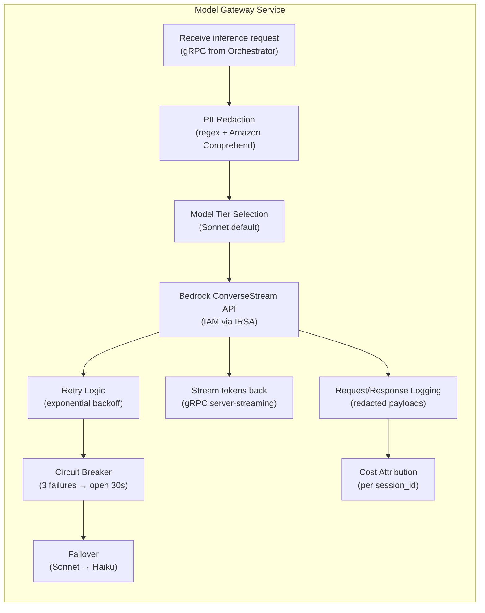
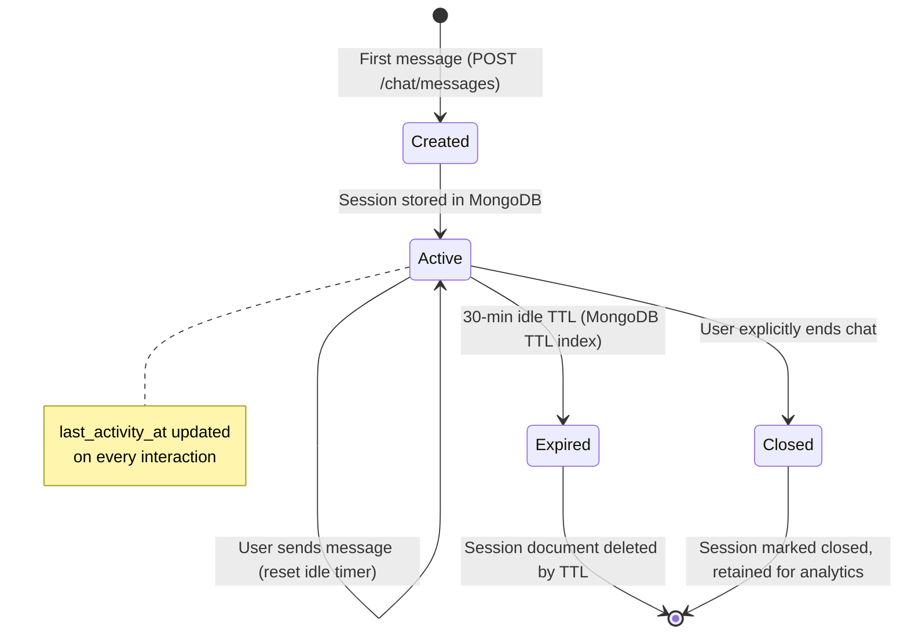

# Capability: Conversation Orchestration

## Description

The orchestration layer that manages the conversation lifecycle: intent routing via Claude `tool_use`, MCP tool dispatch, session state management, SSE response streaming, conversation history windowing, and human escalation detection. This capability is not exposed as an MCP tool — it is the orchestrator service itself.

The orchestrator delegates all LLM interaction to the **Model Gateway** and all domain actions to the **MCP Tool Server**.

## Requirements

### Intent Routing

#### REQ-CO-01: Claude tool_use for Intent Classification

The orchestrator MUST use Claude's native `tool_use` capability for intent routing. The system prompt and tool declarations guide the LLM to select the appropriate MCP tool. The orchestrator does NOT perform intent classification separately — Claude determines intent and tool selection in a single inference call.

#### REQ-CO-02: Tool Availability by User Type

The orchestrator MUST present only the tools available to the current user type:
- **Anonymous (prospect)**: `troubleshoot_lookup`, `search_houses`
- **Authenticated (resident)**: `troubleshoot_lookup`, `search_houses`, `create_ticket`

> **Phase 1**: All users are anonymous. All 3 tools are available but `create_ticket` runs without auth gate enforcement.
> **Phase 2+**: Tool availability is determined by JWT presence.

#### REQ-CO-03: Multi-Tool Turns

The orchestrator MUST support turns where the LLM calls multiple tools sequentially (e.g., `troubleshoot_lookup` followed by `create_ticket` if the user asks to troubleshoot and then create a ticket in one message).

### Model Gateway

The Model Gateway is a dedicated service that **owns all LLM provider interaction** (Architectural Invariant #5). No other component communicates with Bedrock directly.

#### REQ-CO-04: Model Gateway Responsibilities

The Model Gateway MUST handle:



#### REQ-CO-05: Model Tier Strategy

| Tier | Use Case (Phase 3) | Approx. Cost | Latency |
|------|-------------------|-------------|---------|
| **Claude 3.x Haiku** | Simple intent classification, chitchat | Lowest | Fastest |
| **Claude 3.x Sonnet** | General troubleshooting, tool orchestration | Medium | Medium |
| **Claude 3.x Opus** | Complex multi-step reasoning (reserved) | Highest | Slowest |

> **Phase 1–2**: Sonnet only. Phase 3 decision driven by Phase 2 cost and latency telemetry.

#### REQ-CO-06: PII Redaction Before Egress

```
User message → Orchestrator → Model Gateway
                                    │
                                    ├─ Step 1: Regex patterns (SSN, phone, email, credit card)
                                    ├─ Step 2: Amazon Comprehend DetectPiiEntities (NAME, ADDRESS)
                                    ├─ Step 3: Replace with tokens: [PII:NAME], [PII:PHONE], etc.
                                    ├─ Step 4: Log redaction manifest (original ↔ token mapping)
                                    │           Manifest stored in encrypted S3, 90-day retention
                                    └─ Step 5: Send redacted payload to Bedrock
```

PII redaction is applied **before egress** to Bedrock. The redaction manifest allows re-identification only by authorised personnel via a separate audit service (out of scope for Phase 1).

#### REQ-CO-07: Failure Modes & Recovery

| Failure | Detection | Response | Recovery |
|---------|-----------|----------|----------|
| Bedrock 429 (throttled) | HTTP status | Exponential backoff (100ms, 200ms, 400ms, max 3 retries) | Auto-retry |
| Bedrock 5xx | HTTP status | Circuit breaker opens after 3 consecutive failures | Failover to Haiku; half-open after 30s |
| Bedrock timeout (>10s) | Client timeout | Cancel request, return partial if tokens received | Retry once with shorter max_tokens |
| Comprehend unavailable | HTTP error | **Skip PII redaction, log warning, proceed** (availability > redaction) | Alert on repeated failures |
| Network partition | Connection error | Circuit breaker | Service restart via Fargate |

### Session & State Management

#### REQ-CO-08: Session Lifecycle



#### REQ-CO-09: Externalised State

All session state MUST be stored in MongoDB — **never in pod memory** (Architectural Invariant #4). This enables:
- Stateless orchestrator pods (any pod can serve any session)
- Zero-downtime deployments (no session drain needed)
- Session resume after client disconnect/reconnect

#### REQ-CO-10: Conversation History Windowing

- Full history stored in `conversation_turns` collection
- Sliding window of last N turns sent to Claude (configurable, default: 20 turns)
- Older turns summarised and prepended as a system message to maintain context

### SSE Streaming

#### REQ-CO-11: SSE Transport

```
Client                          Orchestrator                     Model Gateway
  │                                  │                                │
  │── GET /chat/stream ──────────────│                                │
  │   {session_id, last_event_id}    │                                │
  │                                  │                                │
  │◄── SSE: event: connected ────────│                                │
  │    data: {session_id}            │                                │
  │                                  │                                │
  │── POST /chat/messages ───────────│                                │
  │   {session_id, message}          │── gRPC ConverseStream ─────────│
  │                                  │                                │── Bedrock
  │                                  │◄── token chunk ────────────────│
  │◄── SSE: event: token ───────────│                                │
  │    data: {text: "Based"}         │◄── token chunk ────────────────│
  │◄── SSE: event: token ───────────│                                │
  │    data: {text: " on"}           │◄── tool_use event ─────────────│
  │◄── SSE: event: tool_start ──────│                                │
  │    data: {tool: "troubleshoot…"} │    (execute MCP tool)          │
  │◄── SSE: event: tool_end ────────│                                │
  │    data: {tool: "troubleshoot…"} │── gRPC ConverseStream (cont) ──│
  │                                  │◄── token chunk ────────────────│
  │◄── SSE: event: token ───────────│                                │
  │    data: {text: "your AC…"}      │◄── end_turn ───────────────────│
  │◄── SSE: event: done ────────────│                                │
  │    data: {turn_index: 5}         │                                │
```

#### REQ-CO-12: SSE Event Types

| Event | Payload | Purpose |
|-------|---------|---------|
| `connected` | `{session_id}` | SSE connection established |
| `token` | `{text, turn_index}` | Streamed LLM token |
| `tool_start` | `{tool, turn_index}` | Tool execution beginning (UI can show spinner) |
| `tool_end` | `{tool, turn_index}` | Tool execution complete |
| `done` | `{turn_index, token_usage}` | Turn complete |
| `error` | `{code, message}` | Error during processing |
| `heartbeat` | `{}` | Keep-alive (every 15s) |

### Human Escalation Detection

#### REQ-CO-13: Escalation Triggers

The orchestrator (via LLM) MUST detect escalation conditions:
- User explicitly requests to speak to a human
- LLM determines it cannot resolve the issue after multiple turns
- A compliance-sensitive topic is detected

When triggered, the LLM calls `create_ticket` with `category: "escalation"`. See [Incident Management](incident-management.md) for the escalation flow.

## Scenarios

### Scenario 1: Multi-Turn Conversation with Tool Execution

**Given** a user sends a message
**When** the orchestrator processes it
**Then** it:
1. Loads session from MongoDB
2. Appends user message to conversation history
3. Sends history + tool declarations to Model Gateway
4. Model Gateway streams back (via gRPC) with potential `tool_use` events
5. Orchestrator executes any MCP tool calls
6. Sends tool results back to Model Gateway for final response generation
7. Streams final tokens to client via SSE
8. Persists assistant response to session

### Scenario 2: Session Expiry

**Given** a session has been idle for > 30 minutes
**When** the MongoDB TTL index fires
**Then** the session document is automatically deleted
**And** subsequent messages from the same `session_id` create a new session

### Scenario 3: Circuit Breaker Failover

**Given** Bedrock returns 3 consecutive 5xx errors
**When** the circuit breaker opens
**Then** subsequent requests failover from Sonnet to Haiku
**And** after 30 seconds, the circuit breaker enters half-open state (single probe request to Sonnet)
**And** if the probe succeeds, traffic returns to Sonnet

### Scenario 4: PII in User Message

**Given** a user message contains "My name is Jane Doe, call me at 555-1234"
**When** the Model Gateway processes the egress payload
**Then** PII is redacted: "My name is [PII:NAME], call me at [PII:PHONE]"
**And** the redaction manifest is stored in encrypted S3
**And** the redacted payload is sent to Bedrock

## Acceptance Criteria

| Criteria | Phase 1 | Phase 2 | Phase 3 |
|----------|---------|---------|---------|
| First-token latency (p50) | < 2s | < 1.5s | < 1s |
| First-token latency (p99) | < 4s | < 3s | < 2s |
| End-to-end response (p95) | < 6s | < 5s | < 3.5s |
| Session state externalised | ✅ | ✅ | ✅ |
| SSE streaming functional | ✅ | ✅ | ✅ |
| PII redaction | Regex only | + Amazon Comprehend | + audit trail |
| Availability (monthly) | 95% | 99.5% | 99.9% |
| Cost ceiling (monthly) | $500 | $3,000 | $15,000 |

## Phase Applicability

| Phase | Model Gateway | Session Store | Auth |
|-------|---------------|---------------|------|
| Phase 1 | Sonnet only, regex PII | MongoDB (TTL 30min) | All anonymous |
| Phase 2 | Sonnet only, + Comprehend | Same | Okta OIDC integrated |
| Phase 3 | + dynamic tier selection | Same | Same |

## Out of Scope

- **Voice channel**: Web chat widget only
- **Mobile/SMS**: No native app or SMS integration
- **Live chat handoff**: Escalation is asynchronous only
- **Custom model fine-tuning**: Uses Bedrock foundation models as-is
