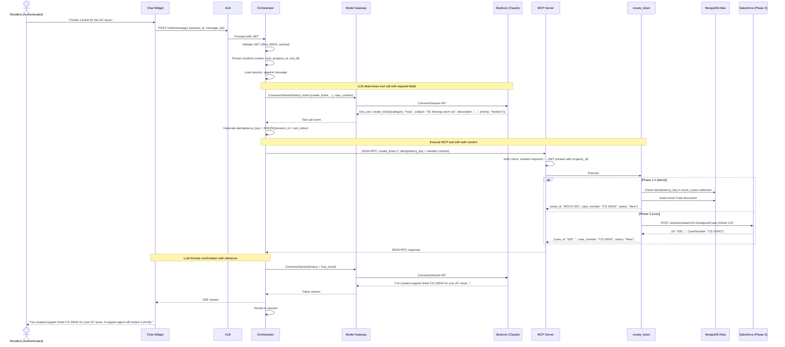
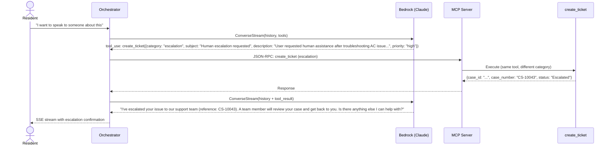

# Capability: Incident Management

## Description

Enables authenticated residents to create support tickets when troubleshooting does not resolve their issue, and to read back ticket status. Also provides the human escalation path — when a user requests to speak to a human, the system creates an escalation ticket asynchronously.

Available to **authenticated residents only** (Phase 2+). In Phase 1 all users are treated as anonymous, so ticket creation is exercised without the auth gate.

## User Story

> *"As a user, I can create a ticket/incident when the issue is not resolved by the answer."*

## Requirements

### REQ-IM-01: Ticket Creation

The system MUST create a support ticket via the [`create_ticket`](../contracts/create-ticket.md) MCP tool when the LLM determines that ticket creation is appropriate (user requests it, or troubleshooting is exhausted).

The ticket MUST include:
- `category`: The issue category (e.g., `hvac`, `smart_lock`, `hoa_violation`, `escalation`)
- `subject`: A concise summary derived from the conversation
- `description`: Detailed context from the conversation
- `priority`: Determined by the LLM based on urgency signals

### REQ-IM-02: Authentication Gate (Phase 2+)

Ticket creation MUST require a valid resident JWT. Enforcement is in the MCP tool router, never in prompt instructions (Architectural Invariant #2).

If an anonymous user (no JWT) triggers a flow requiring `create_ticket`, the MCP server MUST return `AUTH_REQUIRED`. The LLM is instructed to respond: *"To create a support ticket, you'll need to sign in first."*

> **Phase 1**: Auth gate is not enforced. All users are anonymous. Ticket creation is exercised against mock backend without auth checks.

### REQ-IM-03: Idempotency

Ticket creation MUST be idempotent within a 1-hour window. The `idempotency_key` is generated by the orchestrator as `SHA256(session_id + turn_index)`.

If a duplicate request is detected:
- Return the original ticket (do not create a new one)
- Return error code `DUPLICATE_DETECTED` with the original ticket details

### REQ-IM-04: Resident Context Scoping

Tickets MUST be scoped to the resident's property. The resident context (`okta_sub`, `property_id`, `unit_id`) is resolved via MongoDB lookup using the Okta Subject ID from the JWT, and attached to the ticket.

### REQ-IM-05: Ticket Read-Back

Authenticated residents MUST be able to read the status of their own tickets. Read-back is filtered by `okta_sub` to ensure residents can only see their own tickets.

### REQ-IM-06: Confirmation Response

After successful ticket creation, the LLM MUST format a confirmation message including the `case_number` as a reference for the user.

Example: *"I've created support ticket CS-10042 for your AC issue. A support agent will review it shortly."*

### REQ-IM-07: Human Escalation

Human escalation reuses the `create_ticket` tool with `category: "escalation"`. Escalation is triggered when:
- The user explicitly requests to speak to a human
- The LLM determines it cannot resolve the issue after multiple turns
- A compliance-sensitive topic is detected

Escalation is **asynchronous** — a Salesforce ticket is created for a human agent to review. There is no live chat handoff.

## Scenarios

### Scenario 1: Ticket Creation (Authenticated Resident)

### Scenario 2: Auth Gate Rejection (Anonymous User)

**Given** an anonymous prospect (no JWT) is chatting
**When** the conversation triggers `create_ticket`
**Then** the MCP server returns `AUTH_REQUIRED`
**And** the LLM responds: *"To create a support ticket, you'll need to sign in first."*

> **Note**: This scenario applies from Phase 2 onwards. In Phase 1, all users are anonymous and the auth gate is not enforced.

### Scenario 3: Duplicate Ticket Detection

**Given** a resident already created a ticket in the current turn
**When** a retry or duplicate request arrives with the same `idempotency_key`
**Then** the tool returns `DUPLICATE_DETECTED` with the original ticket details
**And** the LLM responds with the existing ticket reference (no new ticket created)

### Scenario 4: Human Escalation

## Acceptance Criteria

| Criteria | Phase 1 | Phase 2 | Phase 3 |
|----------|---------|---------|---------|
| Auth gate enforcement | Not enforced (all anonymous) | Enforced (anonymous blocked) | Enforced |
| Idempotency window | 1 hour | 1 hour | 1 hour |
| `create_ticket` p99 latency | < 300ms | < 300ms | < 2s |
| Ticket scoped to resident's property | N/A (no auth) | ✅ | ✅ |
| Escalation creates ticket with `category: escalation` | ✅ | ✅ | ✅ |

## Tool Dependency

- [`create_ticket`](../contracts/create-ticket.md) — Full schema, error taxonomy, idempotency spec, and phase-specific backend details

## Phase Applicability

| Phase | Auth Gate | Backend | Notes |
|-------|-----------|---------|-------|
| Phase 1 | Not enforced | MongoDB `mock_cases` | Validate tool contract, no auth |
| Phase 2 | Enforced (Okta OIDC) | MongoDB `mock_cases` | Auth gate live, mock Salesforce |
| Phase 3 | Enforced | Salesforce REST API | Live case CRUD (clean slate, no mock migration) |

## Out of Scope

- **Live chat handoff**: Escalation is asynchronous (ticket creation). No real-time transfer to human agent
- **Ticket updates by user**: Residents can create and read tickets, not update or close them
- **SLA tracking**: No SLA enforcement or tracking on ticket resolution time
