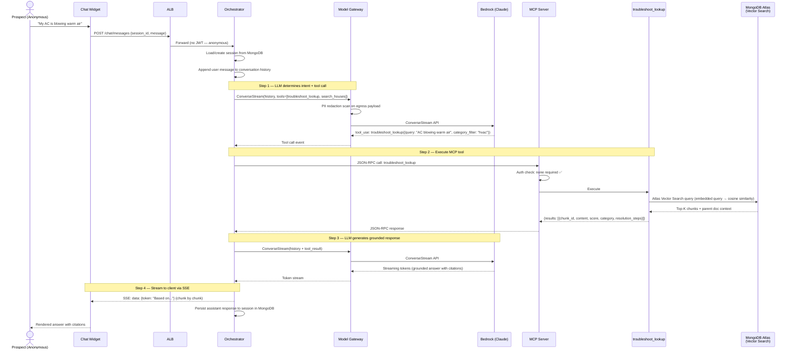

# Capability: Knowledge Troubleshooting

## Description

Provides grounded troubleshooting answers for HVAC systems, smart locks, and HOA violations using RAG retrieval over a knowledge corpus of ~100,000 incident documents. Answers include citations to source material. When the corpus cannot answer a query, the system explicitly refuses and offers to create a support ticket.

Available to **all users** (anonymous prospects and authenticated residents).

## User Story

> *"As a user, I can ask about HVAC, smart locks, and HOA violations and get a grounded troubleshooting answer or the information I need."*

## Requirements

### REQ-KT-01: RAG-Grounded Answers

The system MUST retrieve relevant knowledge chunks via the [`troubleshoot_lookup`](../contracts/troubleshoot-lookup.md) MCP tool and use them to ground the LLM response. The LLM MUST NOT answer troubleshooting questions from its parametric knowledge alone.

### REQ-KT-02: Citation Format

Responses MUST include citations referencing the source incident documents used to generate the answer. Citations link the answer back to specific knowledge base entries.

### REQ-KT-03: Category Filtering

Queries SHOULD be routed with a `category_filter` (one of: `hvac`, `smart_lock`, `hoa_violation`) when the LLM can determine the category from context. This narrows the vector search space and improves retrieval precision.

### REQ-KT-04: Explicit Refusal

When `troubleshoot_lookup` returns `NO_RESULTS` or all similarity scores are below the refusal threshold (< 0.3), the LLM MUST refuse explicitly rather than hallucinate an answer.

The refusal response MUST:
- Acknowledge the question
- State that the knowledge base does not contain sufficient information
- Offer an alternative action (e.g., creating a support ticket for authenticated users)

Example: *"I don't have enough information to answer that. Would you like me to create a support ticket?"*

### REQ-KT-05: Anonymous Access

This capability MUST be available without authentication. No JWT is required. Both prospects and residents can use it.

### REQ-KT-06: Multi-Turn Context

The system MUST support follow-up questions within the same session. Conversation history is sent to the LLM to enable contextual follow-ups (e.g., "What about the filter?" after an AC troubleshooting answer).

## Scenarios

### Scenario 1: Happy Path — Troubleshooting Query (Anonymous)

### Scenario 2: Refusal Path — No Relevant Knowledge

**Given** a user asks a question outside the knowledge corpus (e.g., "What's the weather today?")
**When** `troubleshoot_lookup` returns `NO_RESULTS` or all scores < 0.3
**Then** the LLM refuses explicitly and offers an alternative

Expected response: *"I don't have enough information to answer that. Would you like me to create a support ticket?"*

### Scenario 3: Multi-Turn Follow-Up

**Given** a user received a troubleshooting answer about AC issues
**When** the user asks "What about the filter?"
**Then** the orchestrator sends conversation history (including prior tool results) to the LLM, which determines whether to call `troubleshoot_lookup` again with refined context or answer from the existing tool results

## Acceptance Criteria

| Criteria | Phase 1 | Phase 2 | Phase 3 |
|----------|---------|---------|---------|
| RAG groundedness | N/A (fixtures) | ≥ 85% | ≥ 90% |
| Refusal on low-score results | Score < 0.3 | Score < 0.3 | Score < 0.3 |
| `troubleshoot_lookup` p99 latency | < 200ms | < 800ms | < 500ms |
| Intent classification accuracy | N/A | ≥ 90% | ≥ 95% |

## Tool Dependency

- [`troubleshoot_lookup`](../contracts/troubleshoot-lookup.md) — Full schema, error taxonomy, and phase-specific backend details

## Phase Applicability

| Phase | Backend | Notes |
|-------|---------|-------|
| Phase 1 | Fixture JSON file | Validates tool contract and intent routing |
| Phase 2 | Atlas Vector Search (MongoDB) | Live RAG pipeline, real embeddings |
| Phase 3 | Atlas Vector Search + response caching | Caching based on Phase 2 hotspot data |

## Out of Scope

- **Smart-lock actuation**: The agent diagnoses smart lock issues but NEVER sends actuation commands (lock/unlock)
- **Real-time knowledge updates**: Knowledge corpus is updated via batch ingestion (seed script Phase 1–2, Salesforce CDC Phase 3), not real-time
- **Knowledge corpus management UI**: No admin interface for managing incidents
