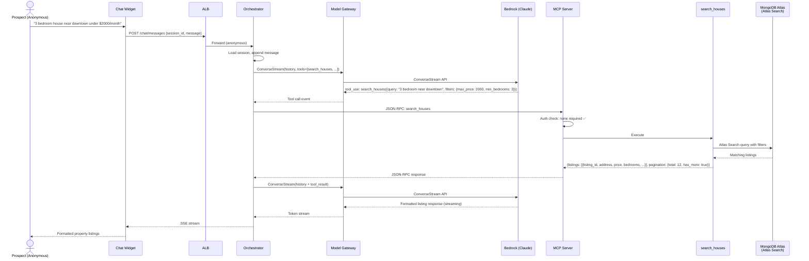

# Capability: Property Search

## Description

Enables users to search for available properties using natural language. The LLM extracts structured filters (price range, bedrooms, location, amenities) from the user's query and invokes the [`search_houses`](../contracts/search-houses.md) MCP tool. Results are formatted as a readable listing with key property details.

Available to **all users** (anonymous prospects and authenticated residents).

## User Story

> *"As a user, I can search for a house in natural language."*

## Requirements

### REQ-PS-01: Natural Language to Structured Filters

The LLM MUST parse natural language queries into structured filter parameters for the `search_houses` tool. Examples:

| User Input | Extracted Filters |
|------------|-------------------|
| "3 bedroom house near downtown under $2000/month" | `{max_price: 2000, min_bedrooms: 3, query: "near downtown"}` |
| "Pet-friendly apartment with pool" | `{amenities: ["pet_friendly", "pool"]}` |
| "Cheapest 2BR in Austin" | `{min_bedrooms: 2, city: "Austin"}` (sorted by price) |

### REQ-PS-02: Pagination

Search results MUST support pagination. The tool returns a `pagination` object with `total` count and `has_more` indicator. The LLM can request additional pages in follow-up turns.

### REQ-PS-03: Result Formatting

The LLM MUST format search results into a readable listing including: address, price, bedrooms, bathrooms, square footage, and key amenities. Results should be presented in a scannable format.

### REQ-PS-04: Empty Results

When `search_houses` returns `NO_RESULTS`, the LLM MUST:
- Acknowledge that no matching properties were found
- Suggest broadening the search criteria
- Offer to try a modified search

### REQ-PS-05: Anonymous Access

This capability MUST be available without authentication. No JWT is required.

### REQ-PS-06: Follow-Up Refinement

The system MUST support conversational refinement of search results. Example:
1. User: "3 bedroom house under $2000"
2. Agent: Shows results
3. User: "Any of those with a pool?"
4. Agent: Refines search with additional `amenities: ["pool"]` filter

## Scenarios

### Scenario 1: Happy Path — Property Search (Anonymous)

### Scenario 2: No Results

**Given** a user searches for "5 bedroom house under $500/month in Manhattan"
**When** `search_houses` returns `NO_RESULTS`
**Then** the LLM responds with: *"I couldn't find any properties matching those criteria. Would you like to try a broader search? For example, I could look for 3+ bedrooms or increase the budget."*

### Scenario 3: Overly Broad Query

**Given** a user searches for "houses"
**When** `search_houses` returns `QUERY_PARSE_ERROR` (unable to extract meaningful filters)
**Then** the LLM asks for more specific criteria: *"Could you tell me more about what you're looking for? For example, how many bedrooms, your budget range, or a preferred area?"*

### Scenario 4: Follow-Up Refinement

**Given** a user received search results for "3 bedroom under $2000"
**When** the user asks "Do any of those have a garage?"
**Then** the LLM calls `search_houses` with refined filters including `amenities: ["garage"]` and context from the previous search

## Acceptance Criteria

| Criteria | Phase 1 | Phase 2 | Phase 3 |
|----------|---------|---------|---------|
| NL-to-filter extraction | Basic (fixture responses) | ✅ Live | ✅ Live |
| Pagination support | ✅ | ✅ | ✅ |
| `search_houses` p99 latency | < 200ms | < 600ms | < 400ms |
| Empty result handling | ✅ | ✅ | ✅ |

## Tool Dependency

- [`search_houses`](../contracts/search-houses.md) — Full schema, error taxonomy, and phase-specific backend details

## Phase Applicability

| Phase | Backend | Notes |
|-------|---------|-------|
| Phase 1 | Fixture JSON file | Validates tool contract and filter extraction |
| Phase 2 | Atlas Search (MongoDB) | Live full-text + faceted search |
| Phase 3 | Atlas Search + result caching | Caching based on Phase 2 hotspot data |

## Out of Scope

- **Property listing data ingestion**: MongoDB listing collections are treated as read-only. Source-of-truth and ingestion for listings is out of scope
- **Geospatial proximity search**: The data model supports `2dsphere` index, but NL-to-geo queries (e.g., "near downtown") are deferred to Phase 3 refinement
- **Property detail pages**: The agent returns listing summaries, not full detail views. Users are directed to the portal for full listings
